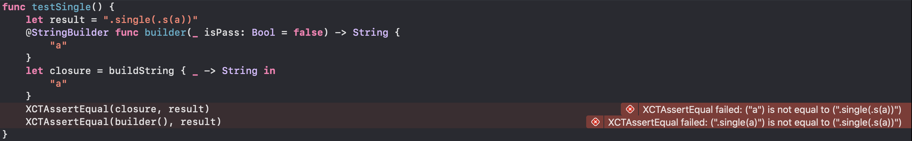

# FunctionBuilderDemo

---

## `@_functionBuilder` 

support: 
 
 * buildBlock
 * buildIf
 * buildEither(left)
 * buildEither(right)
 * buildExpression
 * buildDo

### XCode Version 11.4 (11E146) bug:



---

## [swift Trunk Development 2020/04/17](https://swift.org/builds/development/xcode/swift-DEVELOPMENT-SNAPSHOT-2020-04-17-a/swift-DEVELOPMENT-SNAPSHOT-2020-04-17-a-osx.pkg)

 * fix `XCode Version 11.4 (11E146) bug`
 * support `buildFinalResult`


``` swift
public static func buildFinalResult(_ value: String) -> String {
    return ".result(\(value))"
}
```